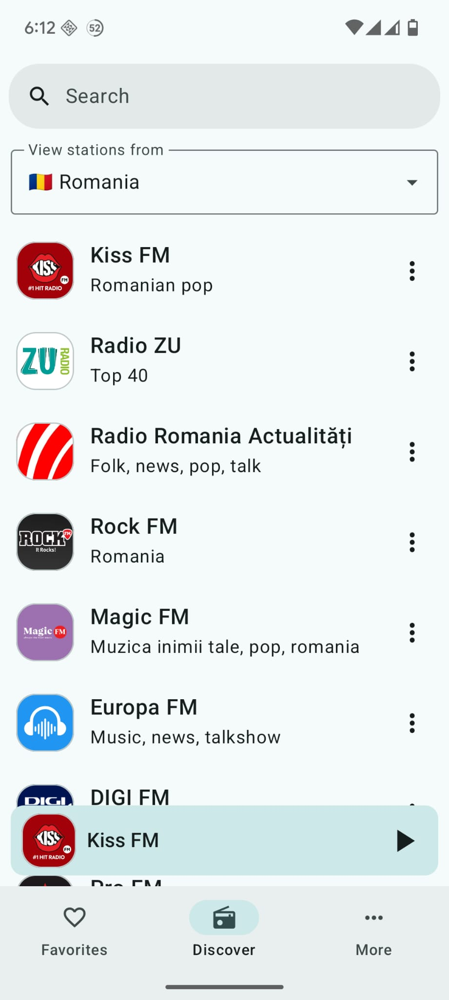
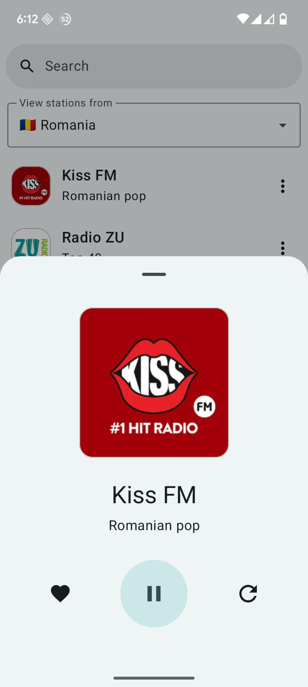

# RadioTime – Live FM & AM Radio App

**RadioTime** is a simple app that lets you listen to live radio stations from around the world. Whether you’re into music, talk, sports, or news, it gives you access to over **35,000 stations** in one place.

---

## About the project

RadioTime was one of my favorite projects to build. It helped me improve a lot as an Android developer.

The app is built entirely with **Jetpack Compose**, and follows the **MVVM** architecture. I used **Media3** for audio playback, **Room** for local storage (like favorites and custom stations), and **WorkManager** for background syncing. It also includes **Android Auto** support, **AdMob** for monetization, and **RevenueCat** for in-app purchases.

---

## Key features

- **Search by name** – Quickly find stations by typing their name  
- **Background playback** – Keep listening while using other apps or when the screen is off  
- **Sleep timer** – Automatically stop playback after a set time  
- **Favorites and shortcuts** – Save stations and pin them to your home screen  
- **Material You design** – The app follows your system’s theme and color palette  
- **Custom stations** – Add your own stream URL if it’s not already listed  
- **Android Auto support** – Use it safely while driving  
- **In-app purchases** – Upgrade to remove ads or support the app  
- **AdMob integration** – Ads are included by default and can be removed  

---

## Tech stack

- Kotlin  
- Jetpack Compose  
- Media3 (ExoPlayer)  
- Room Database  
- WorkManager  
- MVVM architecture  
- Material You  
- AdMob  
- RevenueCat (In-App Purchases)  
- Android Auto support  

---

## Screenshots

  
  
  

<h2>Contribute</h2>  
<a href="https://github.com/mattgdot/RadioStations">Update the repository with radio stations lists</a> 

